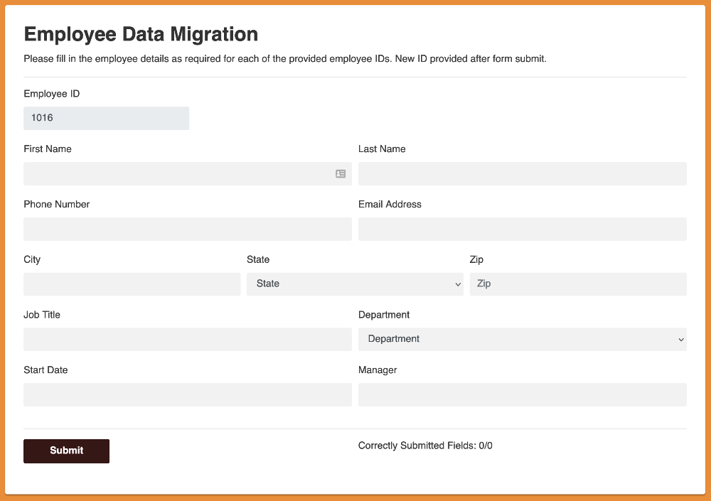

# A robot that completes the human resources challenge



This example robot completes the human resources challenge at https://developer.automationanywhere.com/challenges/automationanywherelabs-employeedatamigration.html.

The challenge involves working with a Windows application, an API, and a web application.

This robot is written in Python. It uses Python standard libraries and some [RPA Framework](https://rpaframework.org/) libraries.

Here is the main "task" definition:

```py
def complete_human_resources_challenge():
    open_employee_list_app(EMPLOYEE_LIST_APP_PATH, EMPLOYEE_LIST_APP_TITLE)
    open_hr_web_app(HR_WEB_APP_URL)
    complete_all_employee_details(AMOUNT_OF_EMPLOYEES_TO_PROCESS)
    take_screenshot_of_results()
```

The Windows application executable is included in the repository for convenience.

> See the full code for implementation details!
